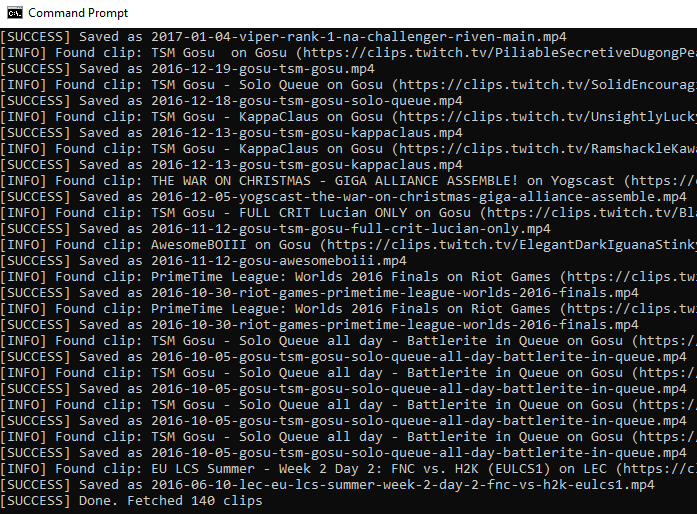
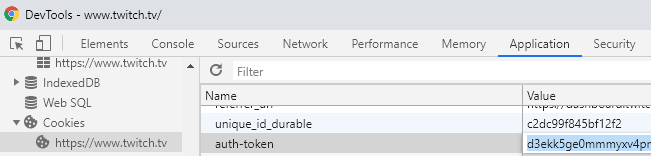

# Twitch clips downloader

Downloads all clips made by you of various streamers to a local directory or top clips of a given channel


## Why?
Many streamers have received copyright complaints over their Twitch clips and are forced to remove all their clips

## Prerequisites
- Python 3
- pip

## How to use - Download your own clips
1. Sign in on [Twitch](https://twitch.tv) using Chrome/Firefox
2. Go to inspect element -> Application tab
3. Go to cookies and copy the auth-token value

4. Run the tool by supplying your username and the auth-token value as seen below

## How to use - Download top clips of a channel
1. Get channelname (twitch.tv/<channelName>)
2. Run `topclips.py` as seen below

## Installation & usage
```bash
git clone https://github.com/TorbenCapiau/Twitch-Clips-Downloader.git
cd Twitch-Clips-Downloader
pip install -r requirements.txt
# Download your own clips
python app.py <Twitch username> <auth-token value>
# Download ALL clips of a channel
python topclips.py <ChannelName>
# Download 5 clips of a channel
python topclips.py <ChannelName> --limit 5
```